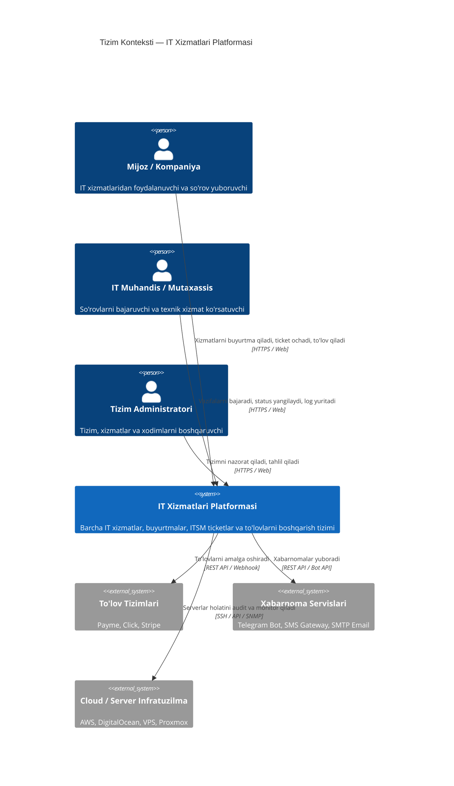

# IT Xizmatlari Platformasi — Tizim Arxitekturasi (System Architecture)

## 1. Loyihaning Maqsadi va Kirish

Ushbu arxitektura zamonaviy axborot texnologiyalari (IT) xizmatlarini ko'rsatuvchi kompaniyalar uchun korporativ darajadagi platforma hisoblanadi. Tizim orqali mijozlar IT xizmatlarini buyurtma qilishi, server va tarmoq infratuzilmasiga texnik xizmat ko'rsatish so'rovlarini (ITSM / Helpdesk) yuborishi, shartnomalar va hisob-kitoblarni boshqarishi hamda loyihalar progressini kuzatib borishi mumkin.

---

## 2. C4 Model Arxitekturasi

### 2.1. Context Diagram (Tizim konteksti)


### 2.2. Container Diagram (Konteynerlar darajasi)
```mermaid
graph TB
    subgraph "Mijoz va Foydalanuvchilar"
        UserApp[Veb Brauzer & Mobil Brauzer]
    end

    subgraph "Frontend Qatlami (Next.js 14+)"
        PublicPortal[Ochiq Portal: Landing & Katalog]
        ClientDashboard[Mijoz Kabineti]
        AdminDashboard[Admin & Muhandis Paneli]
    end

    subgraph "Infratuzilma & Gateway"
        Nginx[Nginx Reverse Proxy & SSL Termination]
    end

    subgraph "Backend Qatlami (NestJS Modular Monolith / Microservices-Ready)"
        AuthService[Auth & IAM Moduli (JWT + RBAC + 2FA)]
        CatalogService[IT Xizmatlar Katalogi Moduli]
        TicketService[ITSM / Ticket & SLA Moduli]
        BillingService[Moliya & Billing Moduli]
        ProjectService[IT Loyihalar Boshqaruvi Moduli]
        NotifService[Xabarnomalar & Worker Moduli]
    end

    subgraph "Ma'lumotlar va Navbat Qatlami"
        Postgres[(PostgreSQL 16 - Relational DB)]
        RedisCache[(Redis - Caching, Session & BullMQ)]
        MinIOStorage[(MinIO / S3 - Hujjatlar & Fayllar)]
    end

    UserApp -->|HTTPS / WSS| Nginx
    Nginx --> PublicPortal
    Nginx --> ClientDashboard
    Nginx --> AdminDashboard

    PublicPortal -->|REST / GraphQL| AuthService
    ClientDashboard -->|REST / GraphQL| TicketService
    AdminDashboard -->|REST / GraphQL| CatalogService

    AuthService --> Postgres
    CatalogService --> Postgres
    TicketService --> Postgres
    BillingService --> Postgres
    ProjectService --> Postgres

    TicketService --> RedisCache
    NotifService --> RedisCache
    TicketService --> MinIOStorage
    BillingService --> MinIOStorage
```

---

## 3. Asosiy Domenlar va Biznes-Mantiq

### 3.1. IT Xizmatlar Katalogi (Service Catalog)
Tizim quyidagi IT xizmat yo'nalishlarini qamrab oladi:
- **Dasturiy Ta'minot Yaratish (Custom Software Development)**: Web ilovalar, mobil ilovalar, korporativ CRM/ERP tizimlari.
- **Server va Cloud Boshqaruvi (Cloud & Infrastructure)**: Linux/Windows server ma'murligi, AWS/GCP arxitekturasi, Kubernetes, Dockerlashtirish.
- **Kiberxavfsizlik va Audit (Cybersecurity & Audit)**: Zaifliklarni tahlil qilish (Penetration Testing), ISO 27001 muvofiqlik, xavfsizlik devori (Firewall) sozlash.
- **24/7 IT Helpdesk va Texnik Xizmat**: Kompyuterlar, ofis uskunalari va tarmoqlarni nosozliklardan himoyalash va bartaraf etish.
- **Tarmoq Infratuzilmasi (Network Engineering)**: Cisco, MikroTik, VPN tarmoqlar, VLAN konfiguratsiyalari.

### 3.2. ITSM & SLA Boshqaruvi (Ticket & Incident Management)
- **Ticket Ustuvorligi (Priority)**:
  - `CRITICAL` (Favqulodda): Reaksiya vaqti ≤ 15 daqiqa, bartaraf etish ≤ 2 soat.
  - `HIGH` (Yuqori): Reaksiya vaqti ≤ 30 daqiqa, bartaraf etish ≤ 4 soat.
  - `MEDIUM` (O'rtacha): Reaksiya vaqti ≤ 2 soat, bartaraf etish ≤ 24 soat.
  - `LOW` (Past): Reaksiya vaqti ≤ 4 soat, bartaraf etish ≤ 48 soat.
- **Ticket Holatlari (Life Cycle)**:
  `OPEN` $\rightarrow$ `ASSIGNED` $\rightarrow$ `IN_PROGRESS` $\rightarrow$ `PENDING_CLIENT` $\rightarrow$ `RESOLVED` $\rightarrow$ `CLOSED`.

### 3.3. Billing va Hisob-Kitob Modeli
- **Obuna asosida (Subscription Retainer)**: Oylik belgilangan IT xizmat ko'rsatish shartnomalari.
- **Vaqt va Materiallar (Time & Material)**: Muhandisning sarflagan soatiga qarab to'lov.
- **Qat'iy narx (Fixed Price)**: Maxsus dasturiy loyihalar uchun bosqichma-bosqich (Milestone-based) to'lov.

---

## 4. Xavfsizlik va Masshtablash (Security & Scalability)

1. **Autentifikatsiya va Avtorizatsiya**:
   - JWT (Access & Refresh tokenlar) + Redis session revocation.
   - RBAC (Role-Based Access Control): `SUPER_ADMIN`, `TECH_LEAD`, `ENGINEER`, `CLIENT_ADMIN`, `CLIENT_STAFF`.
2. **Ma'lumotlar Himoyasi**:
   - Parollarni Argon2 / Bcrypt orqali shifrlash.
   - Barcha API so'rovlarida Rate Limiting (Throttling) va CORS himoyasi.
   - TLS 1.3 shifrlangan aloqa.
3. **Masshtablash (Scalability)**:
   - Stateless backend arxitekturasi tufayli konteynerlarni gorizontal ko'paytirish (Horizontal Auto-scaling).
   - Redis orqali tez-tez so'raladigan ma'lumotlarni keshlashtirish.
   - PostgreSQL Read Replica arxitekturasiga tayyorlik.
