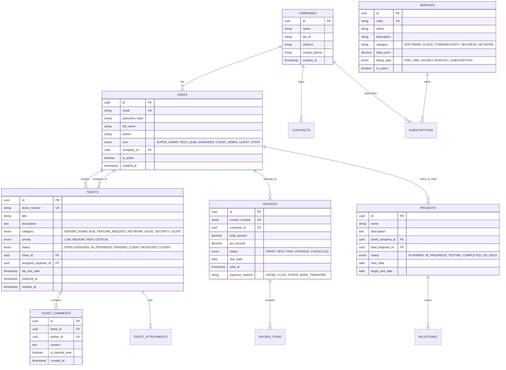

# IT Xizmatlari Platformasi — Ma'lumotlar Bazasi Sxemasi (Database Schema)

Tizim relyatsion **PostgreSQL 16+** va ORM sifatida **Prisma / TypeORM** dan foydalanadi.

---

## 1. ERD (Entity Relationship Diagram)

---

## 2. Asosiy Jadvallar Tavsifi

1. **`users`**: Tizim foydalanuvchilari (Mijozlar, IT muhandislar, Administratorlar).
2. **`companies`**: Korporativ mijozlar va yuridik shaxslar ma'lumotlari.
3. **`services`**: IT xizmatlari katalogi, narxlar va xizmat turlari.
4. **`tickets`**: ITSM yordam va nosozliklarni qayd qilish jadvallari, SLA vaqt hisoboti.
5. **`ticket_comments`**: Ticketlar bo'yicha mijoz va muhandislar muloqoti.
6. **`invoices` & `invoice_items`**: Barcha oylik va bir martalik IT xizmatlar to'lov hisob-kitoblari.
7. **`projects` & `milestones`**: Katta hajmdagi IT loyihalar boshqaruvi.
